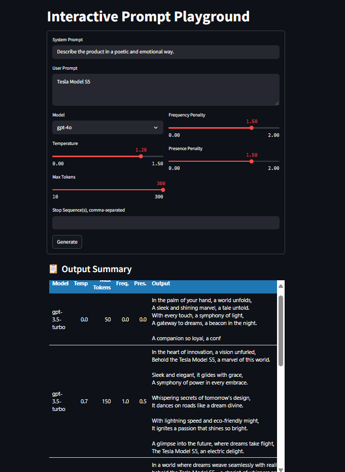
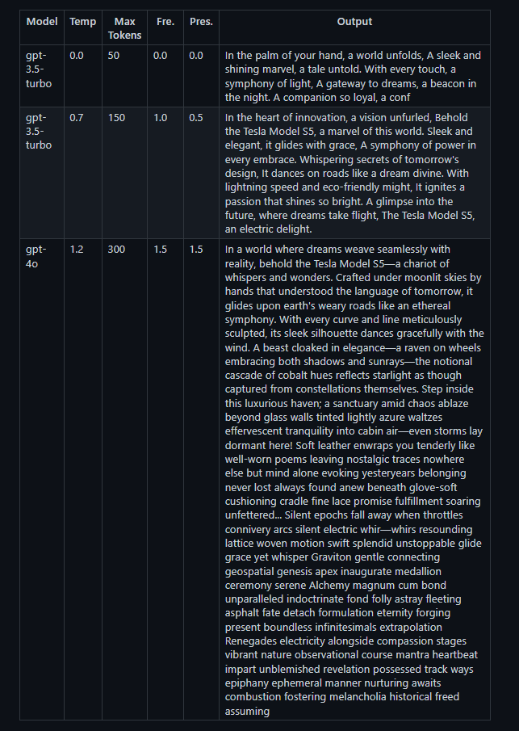

# Interactive Prompt Playground

A user-configurable Streamlit application for testing and comparing OpenAI model outputs with different parameter combinations. Perfect for prompt engineering, parameter tuning, and understanding how various settings affect AI-generated content.



## 🎯 Features

- **Multi-Model Support**: Test with GPT-3.5-turbo or GPT-4o
- **Parameter Testing**: Experiment with temperature, max tokens, frequency penalty, and presence penalty
- **Real-time Comparison**: View all outputs in an organized table format
- **Reflection Notes**: Built-in text area for documenting observations and insights
- **Custom Prompts**: Configurable system and user prompts
- **Stop Sequences**: Define custom stop sequences for output control

## 🚀 Getting Started

### Prerequisites

- Python 3.7+
- OpenAI API key

### Installation

1. Clone the repository:
```bash
git clone https://github.com/haarry9/interactive-prompt-playground.git
cd interactive-prompt-playground
```

2. Install dependencies:
```bash
pip install -r requirements.txt
```

3. Create a `.env` file in the project root and add your OpenAI API key:
```
OPENAI_API_KEY=your_openai_api_key_here
```

### Running the Application

```bash
streamlit run app.py
```

The app will open in your default browser at `http://localhost:8501`

## 📋 Usage

1. **Configure Prompts**: Set your system prompt (AI personality) and user prompt (the question/request)
2. **Select Model**: Choose between GPT-3.5-turbo or GPT-4o
3. **Adjust Parameters**:
   - **Temperature** (0.0-1.5): Controls randomness/creativity
   - **Max Tokens** (10-300): Limits response length
   - **Frequency Penalty** (0.0-2.0): Reduces repetition of frequent tokens
   - **Presence Penalty** (0.0-2.0): Encourages topic diversity
   - **Stop Sequences**: Custom stopping points (optional)
4. **Generate**: Click "Generate" to create a response
5. **Compare Results**: View all outputs in the results table
6. **Document Insights**: Use the reflection area to note observations

## 🔬 Experiment Suggestions

### Recommended Test Values

| Parameter | Test Values |
|-----------|-------------|
| Temperature | 0.0, 0.7, 1.2 |
| Max Tokens | 50, 150, 300 |
| Presence Penalty | 0.0, 1.5 |
| Frequency Penalty | 0.0, 1.5 |

### Sample Prompts

